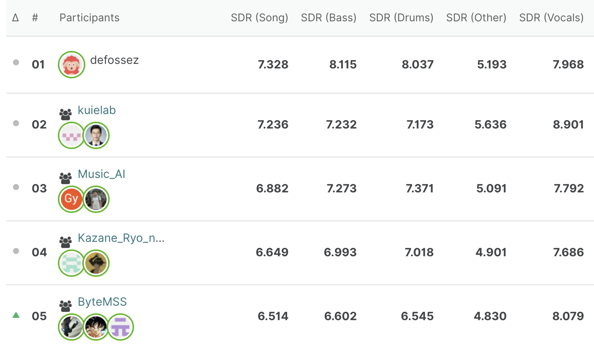

# Music Source Separation with Channel-wise Subband Phase Aware ResUnet (CWS-PResUNet)
## Introduction
This repo contains the pretrained Music Source Separation models I submitted to the [2021 ISMIR MSS Challenge](https://www.aicrowd.com/challenges/music-demixing-challenge-ismir-2021).
We only participate the Leaderboard A, so these models are only trained on MUSDB18HQ.

You can use this repo to separate 'bass', 'drums', 'vocals', and 'other' tracks from a music mixture.
Also we provides our *vocals* and *other* models' training pipline. You can train your own model easily.

As is shown in the following picture, in leaderboard A, we(ByteMSS) achieved the 2nd on Vocal score and 5th on average score.
For bass and drums separation, we directly use [the open-sourced demucs model](https://github.com/facebookresearch/demucs). It's trained with only MUSDB18HQ data, thus is qualified for LeaderBoard A.



[comment]: <> (We use the following stratagy in this challenges)

[comment]: <> (1. Train models for the four stems &#40;vocals, bass, drums, and other&#41; separately.)

[comment]: <> (2. Use boxcar window to cut down the computation &#40;less overlap between windows&#41;.)

[comment]: <> (3. Separate vocal track first, substract it from the mixture, and use the remaining part to separate other stems.)

[comment]: <> (4. Since our final bass and drums score is still low. We directly use the open-source demucs model as the final submission for these two tracks.)

## 1. Usage
### 1.1 Prepare running environment
First you need to clone this repo:
```shell
git clone https://github.com/haoheliu/CWS-ResUNet-MSS-Challenge-ISMIR-2021.git
```
Install the required packages
```shell
cd CWS-ResUNet-MSS-Challenge-ISMIR-2021 
pip3 install --upgrade virtualenv==16.7.9 # this version virtualenv support the --no-site-packages option
virtualenv --no-site-packages env_mss # create new environment
source env_mss/bin/activate # activate environment
pip3 install -r requirements.txt # install requirements
```
You'd better have *wget* and *unzip* command installed so that to download pretrained models and unzip them.

### 1.2 Use pretrained model
To use the pretrained model to conduct music source separation. You can run the following demo. If it's the first time you run this program, it will automatically download the pretrained models.

```shell
# <input-wav-file-path> is the .wav file to be separated
# <output-path-dir> is the folder to store the separation results 
# python3 main.py -i <input-wav-file-path> -o <output-path-dir>
python3 main.py -i example/test/zeno_sign_stereo.wav -o example/results
```
Each pretrained model in this repo take us approximately two days on 8 V100 GPUs to train.

### 1.3 Train new models from scratch

#### 1.3.1 How to train

For the training data:
- If you havn't download musdb18hq, we will automatically download the dataset for you by running the following command.
- If you have already download musdb18hq, you can put *musdb18hq.zip* or *musdb18hq* folder into the *data*
folder and run *init.sh* to prepare this dataset.
```shell
source init.sh
```
Finally run either of these two commands to start training.
```shell
# For track 'vocals', we use a 4 subbands resunet to perform separation. 
# The input of model is mixture and its output is vocals waveform.
# Note: Batchsize is set to 2 to avoid your gpu OOM, but we use 16 in our experiments. Use as much as you can! 
source models/resunet_conv8_vocals/run.sh

# For track 'other', we also use a 4 subbands resunet to perform separation.
# But for this track, we did a little modification.
# The input of model is mixture, and its output are bass, other and drums waveforms. (bass and drums are only used during training) 
# We calculate the losses for "bass","other", and "drums" these three sources together.
# Result shows that joint training is beneficial for 'other' track.
# Note: Batchsize is set to 2 to avoid your gpu OOM, but we use 16 in our experiments. Use as much as you can!
source models/resunet_joint_training_other/run.sh
```
Training logs will be presented in the *mss_challenge_log* folder by default. System will perform validations every two epoches.

#### 1.3.2 Use the model you trained

To use the the *vocals* and the *other* model you trained by your own. You need to modify the following two variables in the *predictor.py* to the path of your models.

```python3
41 ...
42  v_model_path = <path-to-your-vocals-model>
43  o_model_path = <path-to-your-other-model>
44 ...
```

### 1.4 Model Evaluation

Since the evaluation process is slow, we separate the evaluation process out as a single task. 
It's conducted on the validation results generated during training. 

- We calculate the *sdr*,*isr*, and *sar* with the [BSSEval v4](https://github.com/sigsep/sigsep-mus-eval)
- We calculate the *sisdr* value with the [speechmetrics](https://github.com/aliutkus/speechmetrics).
- We calculate another version (non-windowed) of sdr, *sdr_ismir*, using [the 2021 ISMIR MSS Challenge's implementation](https://github.com/AIcrowd/music-demixing-challenge-starter-kit/blob/master/evaluator/music_demixing.py#L75). 

Steps: 

1. Locate the path of the validation result. After training, you will get a validation folder inside your loging directory (*mss_challenge_log* by default).

2. Determine which kind of source you wanna evaluate (bass, vocals, others or drums). Make sure its results present in the validation folder.

3. Run *eval.sh* with two arguments: the source type and the validation results folder (automatic generated after training in the logging folder). 

For example:

```shell
# source eval.sh <source-type> <your-validation-results-folder-after-training> 

# evaluate vocal score
source eval.sh vocals mss_challenge_log/2021-08-11-subband_four_resunet_for_vocals-vocals/version_0/validations
# evaluate bass score
source eval.sh bass mss_challenge_log/2021-08-11-subband_four_resunet_for_vocals-vocals/version_0/validations
# evaluate drums score
source eval.sh drums mss_challenge_log/2021-08-11-subband_four_resunet_for_vocals-vocals/version_0/validations
# evaluate other score
source eval.sh other mss_challenge_log/2021-08-11-subband_four_resunet_for_vocals-vocals/version_0/validations
```

The system will save the overall score and the score for each song in the result folder.

For faster evalution, you can adjust the parameter *MAX_THREAD* insides the *evaluator/eval.py* to determine how many threads you gonna use. It's value should fit your computer resources. You can start with *MAX_THREAD=3* and then try 6, 10 or 16. 

## 2. todo

- [x] Open-source the training pipline (before 2021-08-20)
- [ ] Write a report paper about my findings in this MSS Challenge (before 2021-08-31)

## 3. Reference

If you find our code useful for your research, please consider citing:

>    @inproceedings{Liu2020,   
>      author={Haohe Liu and Lei Xie and Jian Wu and Geng Yang},   
>      title={{Channel-Wise Subband Input for Better Voice and Accompaniment Separation on High Resolution Music}},   
>      year=2020,   
>      booktitle={Proc. Interspeech 2020},   
>      pages={1241--1245},   
>      doi={10.21437/Interspeech.2020-2555},   
>      url={http://dx.doi.org/10.21437/Interspeech.2020-2555}   
>    }.


